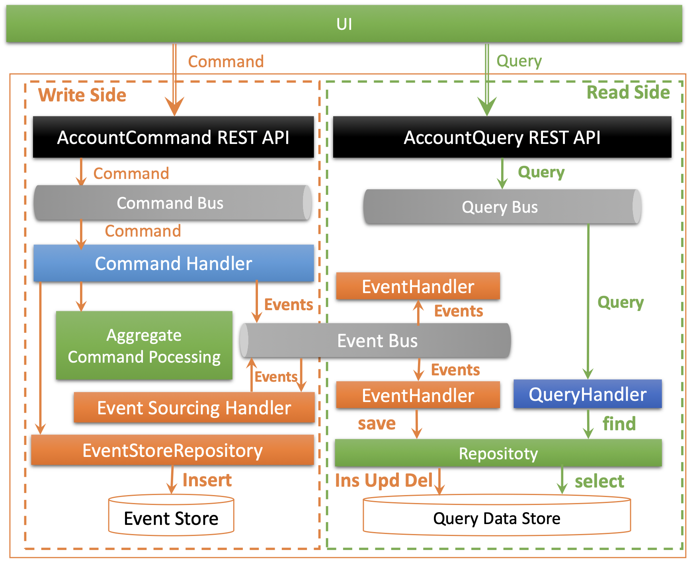
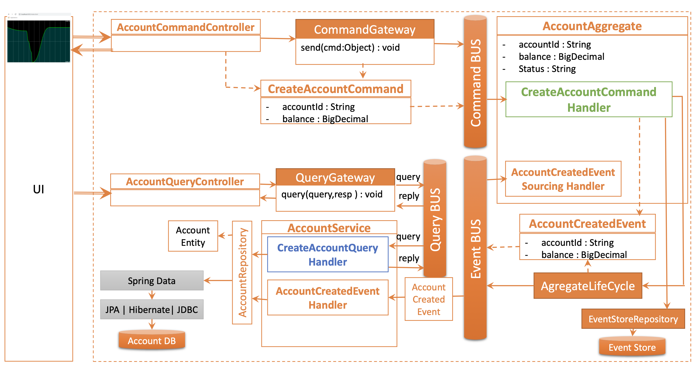
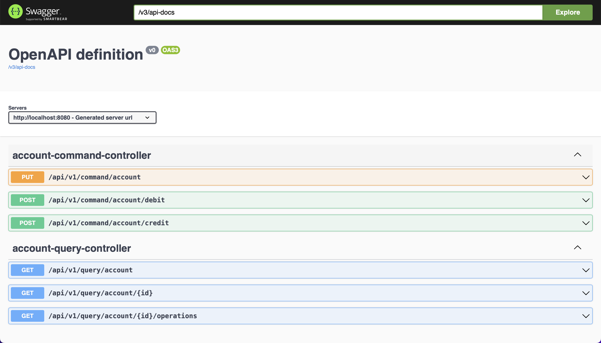

# Société Générale : _Bank account kata v1.0.0_
##  Event Sourcing pattern with CQRS
---
## Requirements
- Deposit and Withdrawal
- Account statement (date, amount, balance)
- Statement printing

## User Stories

- US 1: In order to save money As a bank client I want to make a deposit in my account.
- US 2: In order to retrieve some or all of my savings As a bank client I want to make a withdrawal from my account.
- US 3: In order to check my operations As a bank client I want to see the history (operation, date, amount, balance) of my operations

## Solution
The implementation of a simplified bank account management, the Account class is ready to be used by front-end services or apis but cannot be exposed to the user directly. The validation of the amounts of the different operations must be done before the call of the Account operations.

## Technologies
- Java 17
- Spring boot 3
- Axon framework
- Jpa + Hibernate for data persistence
- database : H2 for dev and test environment (light) and Postgres for prod environment
- MapStruct : mapping between Dtos and java objects
- Lombok : minimizing boilerplate code (constructors, getters and setters...)

## Technical architecture
Event sourcing with CQRS(Command Query Responsibility Segregation) :
CQRS is implemented by a separation of responsibilities between commands and queries, and event sourcing is implemented by using the sequence of events to track changes in data.
### Event Sourcing and CQRS benefits
- Full Audit Trail and Historical Reconstruction
- Scalability and Performance
- Flexibility and Evolvability
- Consistency and Integrity
- Domain-driven Design

## Project structure

## API Documentation
springdoc-openapi :  [http://localhost:8080/swagger-ui/index.html](http://localhost:8080/swagger-ui/index.html)

